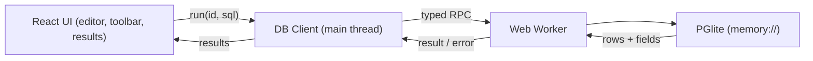
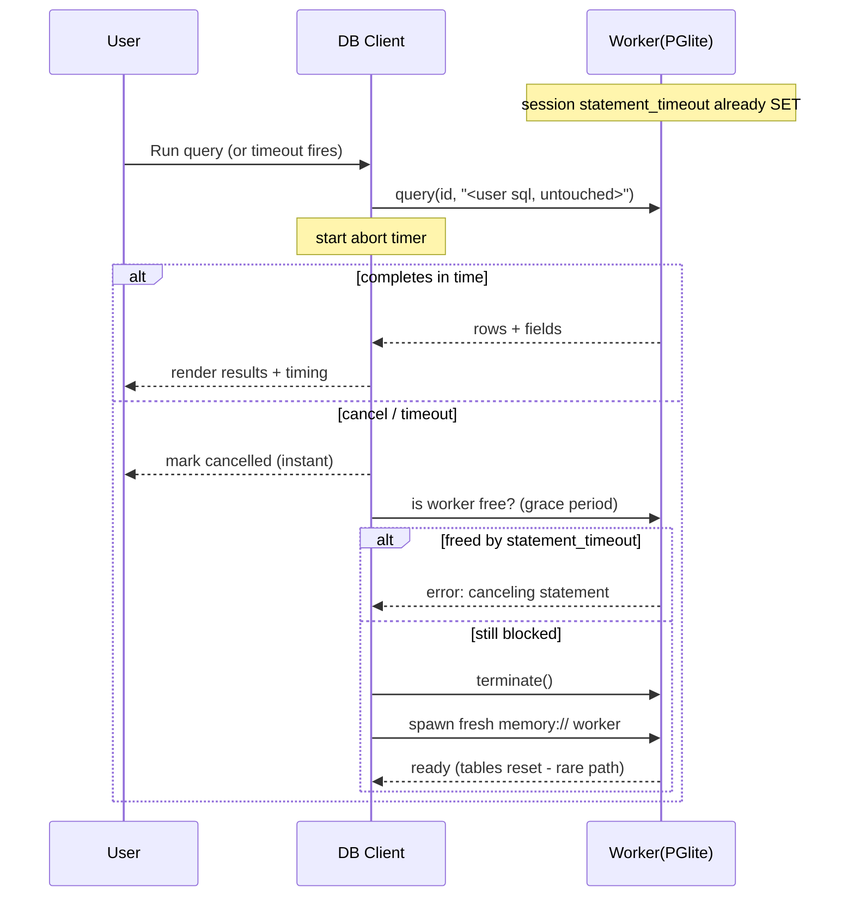
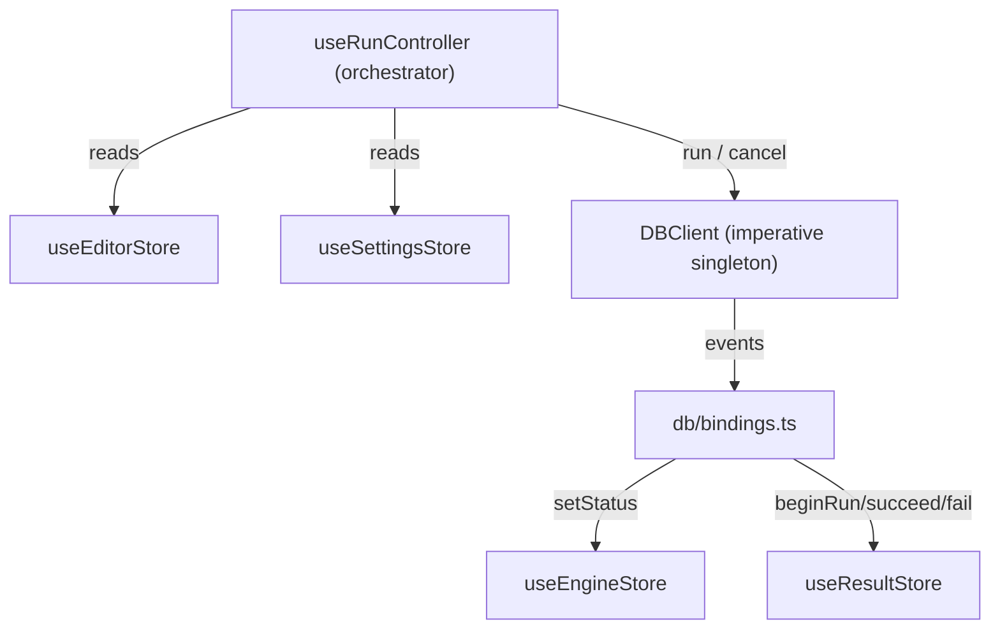

# Local WASM SQL Runner (PGlite)

A 100% frontend React + Vite + TypeScript app. Real PostgreSQL 17 runs via PGlite (`memory://`) in a Web Worker so the main thread never blocks. Query results return as a full JS array from the worker and render in a virtualized table (windowed rendering, not streaming - see Large results). Data is purely in-memory and ephemeral - nothing persists across reloads, prioritizing fast loading and execution.

## Validate first (DONE - spike complete)
The hardest, least-certain part was in-flight cancellation under single-threaded WASM. A spike against real PGlite-in-Node ran first (see `spikes/cancellation/SPIKE_REPORT.md`). Findings:
- `statement_timeout` does NOT abort a CPU-bound query: a 25M-row cross join completed (~1.7s) despite `statement_timeout = 950ms`. The blocked event loop never delivers the timeout for a tight compute loop.
- `terminate()` + respawn takes ~1035ms avg (803-1203ms) in Node with cold wasm; expected faster in-browser once `.wasm` is cached. Treat ~1s as a conservative upper bound.
- Conclusion: the three-layer design is validated and worth building. Soft-cancel is the instant primary UX; `statement_timeout` is free best-effort for cooperative/`pg_sleep` work (not part of the contract); hard-stop is the guaranteed fallback. Because respawn is ~1s and wipes the DB, the `restarting` state must appear immediately and Run stays disabled until `ready` - these are required, not optional.

## Stack
- React + Vite + TypeScript
- `@electric-sql/pglite` (PostgreSQL 17 in WASM), run in a custom Web Worker
- CodeMirror 6 (`@codemirror/lang-sql` PostgreSQL dialect) for the editor
- `@tanstack/react-virtual` for the virtualized results grid
- Zustand for state (multiple single-responsibility stores)
- Vitest + React Testing Library (unit/component), real PGlite in Node (integration), Playwright (E2E)

## Architecture

## Cancellation + timeout strategy (the core design)
Honest framing: PGlite executes Postgres synchronously on the worker thread, so while a CPU-bound query runs the worker's message loop is blocked - it can't process a "cancel" message, and the `statement_timeout` timer often can't be delivered mid-execution. So a query can ALWAYS be stopped, but the only guaranteed stop resets the in-memory DB. Three layers, weakest-but-cheapest to strongest:

1. Soft cancel (instant UX, main-thread only): each run gets an `AbortController` + timer on the main thread. Cancel/timeout immediately rejects the pending promise so the UI shows "cancelled/timed out" and stays responsive. The worker may still be busy in the background.
2. Server-side `statement_timeout` (best-effort, no data loss when it fires): set once at the session level via `SET statement_timeout = <ms>` (updated when the user changes the value) - NOT a per-query transaction wrapper, so the user's SQL is left semantically untouched (no implicit BEGIN/COMMIT that would break VACUUM / CREATE INDEX CONCURRENTLY / user BEGIN). Aborts cleanly for queries that hit a Postgres interrupt check, but is unreliable for exactly the tight CPU loops we most want to kill.
3. Hard stop (the only guaranteed stop): if the worker is still occupied past a short grace period, the client calls `worker.terminate()` and spawns a fresh in-memory worker (~1s, measured). Because the DB is `memory://`, this wipes the session's tables - an accepted v1 trade for max speed/ephemerality. The engine enters `restarting` immediately so the user sees feedback (not a frozen button), the UI clearly warns that force-stop resets the database, and Run is disabled until the new worker reports `ready`.

Spike-confirmed (see `spikes/cancellation/SPIKE_REPORT.md`): `statement_timeout` does not fire for CPU-bound queries, so layer 2 is best-effort only and the guaranteed path is layer 3 (~1s, with reset).

## Ephemerality
- DB is `memory://` - lives only in the worker's memory. Nothing is written to IndexedDB/OPFS, so every page load starts clean. No persistence layer, no wipe-on-load hack.
- Normal completion, query errors, and `statement_timeout` never lose data. Only the force-stop hard-kill resets the in-memory DB.

## Large results (the real bottleneck is the worker boundary, not rendering)
`pg.query()` returns the entire result set as a JS array - there is no incremental cursor streaming into the worker. So a `SELECT * FROM big_table` pays a full structured-clone of every row across `postMessage` and holds it all in memory before `react-virtual` (which only windows rendering) can help. Mitigations baked into the design:
- Hard row cap (default ~10k): the query handler applies a safety `LIMIT` (or truncates) and reports total vs returned so the UI shows a "showing first N of M" banner. Prevents freeze/OOM on accidental huge selects.
- `rowMode: 'array'` in PGlite: returns rows as arrays instead of per-row keyed objects - a much cheaper structured-clone and lower memory for wide/large results. The UI maps columns from `fields` metadata.
- Memoized row rendering in the grid (the grid, not store selectors, is the dominant render cost).
- E2E asserts both the row-cap behavior and that large results don't blow memory - not just that rendering is windowed.

## Typed worker RPC (no raw postMessage in app code)
`postMessage` is used for every query/cancel/restart, so we wrap it in a tiny tailored, type-safe RPC layer. No component or store ever calls `postMessage`/`onmessage` directly.

- Single shared contract `DbRequests` / `DbResponses` keyed by method; `call<M>()` binds payload + resolved types to the method (wrong shapes are compile errors). `serveWorker(handlers)` is exhaustive over every method.
- `WorkerRpc` (main thread) owns id correlation, the pending map, listener lifecycle, per-call `timeoutMs` + `AbortSignal`, and `terminate()/restart()` which `rejectAll(...)` so no promise dangles when we hard-stop a stuck query.
- Errors are normalized through `serializeError`/`deserializeError`, preserving Postgres `code/detail/hint/position` and rethrowing a real `PgError` on the main thread.
- Fresh worker instance + fresh pending map per generation prevents a terminated worker from resolving new calls (stale-response footgun).
- `WorkerRpc` is a generic transport; `DBClient` layers the SQL-domain logic (session statement_timeout, soft/hard cancel, terminate+respawn) on top. Custom instead of Comlink because our cancellation design needs explicit terminate + reject-all-pending.

## State management (Zustand, single-responsibility stores)
No god-store. Each store owns one slice and only its own setters; stores never import each other. All cross-store orchestration lives in the controller/bindings layer.

- `useEngineStore` - worker/PGlite lifecycle only: `status: 'booting' | 'ready' | 'restarting' | 'crashed'`, `engineError`. Mutated solely from `DBClient` events.
- `useEditorStore` - the SQL draft: `sql`, `setSql` (room later for `selection`).
- `useResultStore` - one query run + output: `phase: 'idle' | 'running' | 'cancelling'`, `runId`, `result`, `error`, `durationMs`; setters `beginRun/succeed/fail/cancelling/reset`.
- `useSettingsStore` - user prefs: `timeoutMs` (default 10000), future page size/theme.

Engine vs result are separate on purpose: engine health (alive/restarting) is independent of whether a query is running, avoiding impossible states.

Coupling rules:
- Stores hold state + their own setters only; no store imports another store.
- `DBClient` stays framework- and store-agnostic; it only emits events.
- `src/db/bindings.ts` (wired once at startup) is the ONLY place routing `DBClient` events into engine/result stores.
- `useRunController` is the ONLY place that reads multiple stores (sql + timeout) and drives `DBClient`; components call `controller.run()` / `controller.cancel()`.
- Components select narrow slices (e.g. `useResultStore(s => s.phase)`) to avoid extra re-renders.

## Files (new project from scratch in `/home/eazydiner/sql-fig`)
- `package.json`, `vite.config.ts`, `tsconfig.json`, `index.html`, `README.md`
  - `vite.config.ts`: worker via `new Worker(new URL('./worker.ts', import.meta.url), { type: 'module' })`. No COOP/COEP headers needed - `memory://` PGlite is single-threaded WASM and does not use SharedArrayBuffer (cross-origin isolation is only required for the OPFS access-handle-pool VFS, which we don't use). Consider lazy-loading the worker so first paint isn't blocked by the multi-MB wasm.
- `src/db/rpc/protocol.ts` - shared, types-only `DbRequests`/`DbResponses` contract.
- `src/db/rpc/shared.ts` - envelope types + `SerializedError`/`PgError` + `serializeError`/`deserializeError`.
- `src/db/rpc/server.ts` - `serveWorker(handlers)` (worker side, single `onmessage`).
- `src/db/rpc/client.ts` - `WorkerRpc` (main side): id correlation, pending map, per-call timeout/abort, `terminate()/restart()` with reject-all-pending.
- `src/db/handlers.ts` - pure `createHandlers(db)` factory (init/query/ping) so worker logic is unit/integration-testable against PGlite in Node; query handler uses `rowMode: 'array'` and applies the row cap.
- `src/db/worker.ts` - hosts `new PGlite('memory://')`, prewarms with `SELECT 1`, and wires `serveWorker(createHandlers(db))`.
- `src/db/client.ts` - main-thread controller built on `WorkerRpc`: applies session `statement_timeout`, single in-flight query tracking, `run(sql, { timeoutMs })`, `cancel()`, and the terminate-and-respawn hard-stop logic. Store-agnostic; emits events.
- `src/db/bindings.ts` - wires `DBClient` events into `useEngineStore` / `useResultStore` (the only event->store router).
- `src/stores/engineStore.ts`, `src/stores/editorStore.ts`, `src/stores/resultStore.ts`, `src/stores/settingsStore.ts` - the four single-responsibility Zustand stores.
- `src/hooks/useRunController.ts` - orchestrator hook reading sql + timeout and driving `DBClient`.
- `src/components/Editor.tsx` - CodeMirror 6, PostgreSQL syntax, Cmd/Ctrl+Enter to run.
- `src/components/ResultsTable.tsx` - virtualized rows (array rowMode) mapped via `fields`; row cap + "showing first N of M" banner; memoized row rendering; handles empty/affected-rows/error states.
- `src/components/Toolbar.tsx` - Run, Cancel, timeout input, status (ready/running/restarting), execution time + row count.
- `src/App.tsx`, `src/main.tsx`, `src/types.ts`, `src/styles.css` - layout (editor top, results bottom), clean modern UI.

## Testing (target 80%+ coverage)
Tooling: Vitest + jsdom (unit/component) with v8 coverage gated at 80% (lines/functions/statements/branches); React Testing Library; real PGlite in Node for integration; Playwright for real-browser E2E (Worker + WASM). Only unit/component/integration count toward the coverage %; E2E validates the real-WASM paths separately. Note: FakeWorker/mock-transport unit tests can pass while real single-threaded WASM behaves differently - the cancellation behavior is validated by the Node integration spike + Playwright E2E, not by mocks.

Testability tweaks baked into the design:
- `WorkerRpc` takes a `spawn: () => Worker` factory so a `FakeWorker` is injected in tests.
- `DBClient` depends on a transport interface (the `WorkerRpc`), injectable as a mock.
- Worker logic lives in a pure `createHandlers(db)` factory (in `src/db/handlers.ts`), tested against real `memory://` PGlite in Node without an actual Worker; `worker.ts` just wires `serveWorker(createHandlers(db))`.
- Stores are pure; timers faked via `vi.useFakeTimers()`.

What gets tested:
- Unit: `rpc/shared` error ser/de (preserves pg `code/detail/hint/position`, normalizes non-Errors); `rpc/client` with FakeWorker (id correlation, per-call timeout cleanup, AbortSignal, terminate/restart reject-all, stale-generation responses ignored); `rpc/server` routing; `db/client` with mock transport + fake timers (session statement_timeout applied, success/error, soft-cancel, timeout->cancel sequence, hard-stop terminate+respawn->ready, single-in-flight); `stores/*` transitions; `db/bindings` event routing.
- Component/hook (RTL): `useRunController` orchestration + cancel; `Toolbar` (Run/Cancel enablement, timeout input, status/timing/rowcount); `ResultsTable` (fields/rows, empty/error/affected-rows, row-cap "showing first N of M" banner, virtualization windowing); `Editor` (Cmd/Ctrl+Enter run, value sync).
- Integration (Node, real PGlite): `createHandlers` DDL+DML+SELECT roundtrip, error -> `PgError` with code; statement_timeout behavior on a CPU-bound query (big cross join, the spike case) AND a yielding `pg_sleep`, recording which actually aborts; row cap + rowMode 'array' shape.
- E2E (Playwright): boot->ready, query roundtrip, cancel a runaway query and recover, timeout recovery, force-stop resets DB with warning and stays usable, large SELECT enforces the row cap and does not blow memory (not just windowed rendering).

Coverage gate: `vitest run --coverage` fails CI below 80%; exclude type-only/bootstrap files (`rpc/protocol.ts`, `main.tsx`, `vite-env.d.ts`). CI runs Vitest coverage + Playwright per push.

## Deployment (S3 + CloudFront)
Fully static (`vite build` -> `dist/`); workers and wasm are just static files, so static hosting works. Specifics:

- No cross-origin isolation needed: `memory://` PGlite is single-threaded WASM and does not use SharedArrayBuffer, so do NOT add COOP/COEP. Forcing cross-origin isolation would needlessly break cross-origin iframes/images/embeds for zero benefit. (Only the OPFS access-handle-pool VFS would need it, and we don't use it.)
- WASM MIME: upload `.wasm` with `Content-Type: application/wasm` (else `instantiateStreaming` breaks). PGlite also ships a `.data` FS image - serve it with long-cache immutable too.
- Caching: hashed assets (incl. `.wasm` and `.data`) `Cache-Control: public, max-age=31536000, immutable`; `index.html` `no-cache`; invalidate `/index.html` on deploy.
- Compression: enable CloudFront automatic Brotli/Gzip for the JS + multi-MB wasm (mitigates first-load size).
- Security: private bucket + CloudFront Origin Access Control (OAC).
- Deploy flow: `vite build` -> `aws s3 sync dist/ s3://<bucket>` (correct content-types + cache-control) -> CloudFront invalidation of `/index.html`.

## Performance notes
- First load ships multi-MB Postgres WASM; "fast loading" is relative. Lever: Brotli + immutable caching (repeat visits are instant), lazy-load the worker so first paint isn't blocked, and show real boot progress (booting -> ready) instead of a frozen splash. `SELECT 1` prewarm is fine.
- Renderer hot path is the results grid: memoize row rendering and use `rowMode: 'array'`; narrow Zustand slice selection avoids unrelated re-renders.

## Notes / decisions made
- v1 is minimal per your choice: editor + run-in-worker + virtualized results + cancel + timeout. No schema sidebar, history, export, autocomplete, or reset button yet (all easy follow-ups; the schema-aware autocomplete and reset would slot in naturally later).
- Default timeout: 10s, user-editable in the toolbar.
- Single in-flight query at a time (PGlite is single-connection); new runs are blocked while one is active.
- Indirection check (resolved by spike): the guaranteed stop is real and deliverable, so the full type-safe RPC (terminate + reject-all is genuinely needed) + stores + controller are justified - build as planned rather than collapsing the architecture.